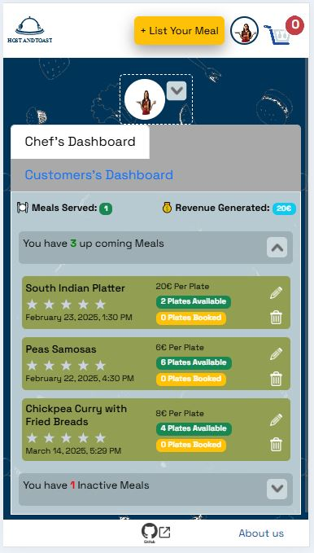
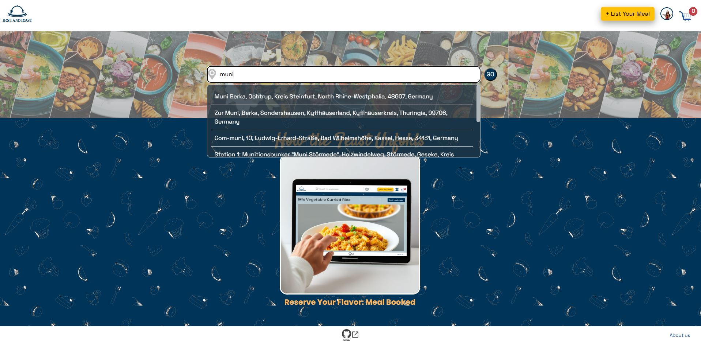
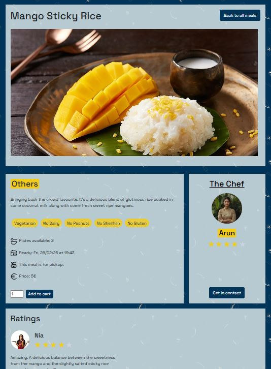
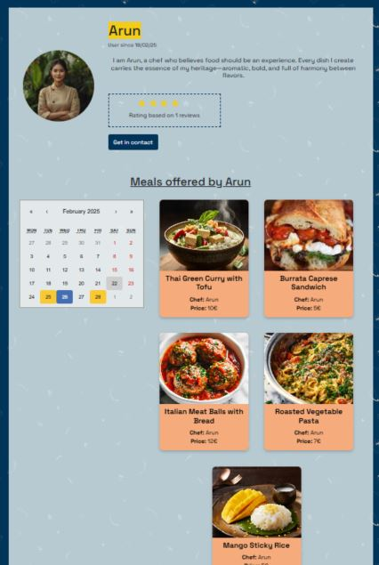
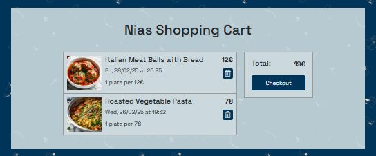
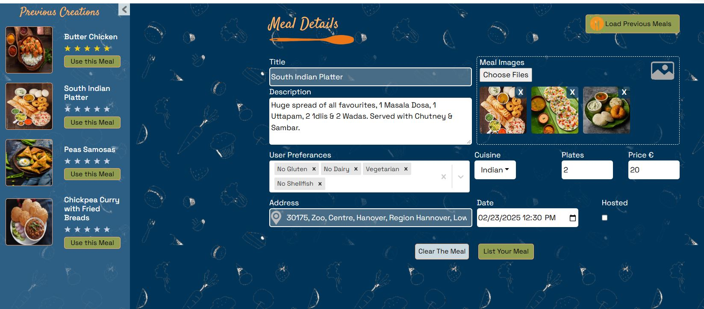
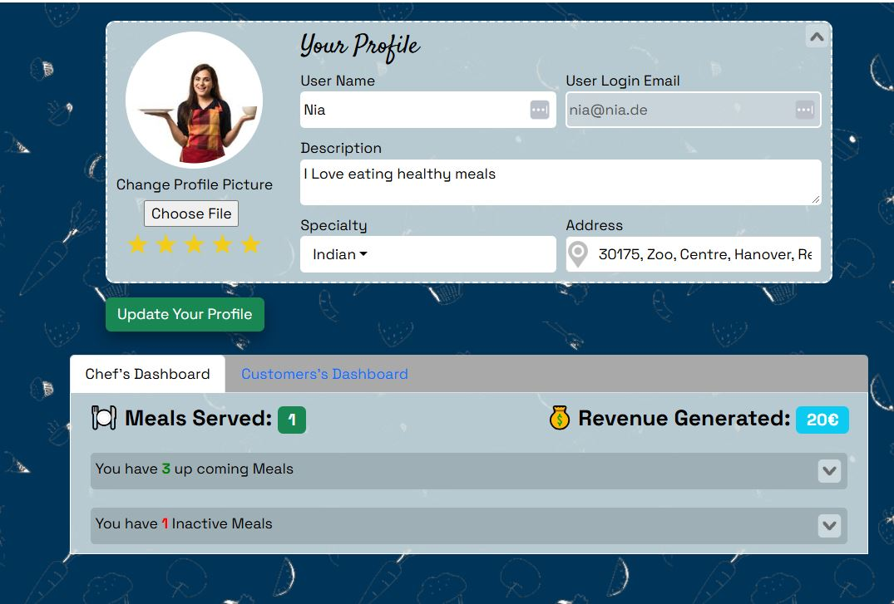
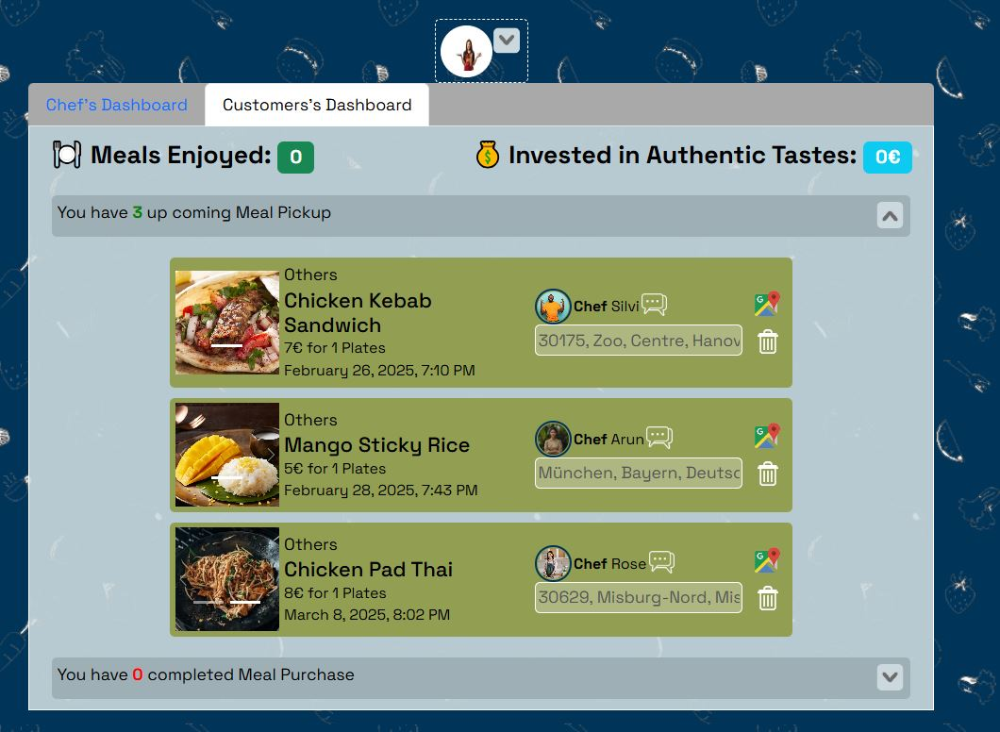

## Description

Host and Toast is a platform where home chefs can share their delicious, home-cooked meals, and food lovers can easily book and enjoy them. We provide an authentic dining experience by connecting passionate cooks with those craving homemade food. Our platform supports seamless payments, user ratings for trust and validation, location-based meal discovery, and more—making home-cooked meals accessible to everyone.

## Tech stack

Built with React JS, Node JS, Express, CSS & HTML.

## Design

The website is designed keeping the main elements in focus, so it's easier to understand the user interface.

## Features

- **Authenticated & Authorized Acess**: The website is secured with authenticated routes. User passwords are securely stored, and sessions are verified using JWT tokens for a smooth and secure experience.</br></br>
- **Responsive Design**: The website is fully responsive, ensuring all features work seamlessly across all devices and screen sizes.</br>
  </br></br>
- **Location Based Search**: Users can search for meals based on their location.</br>
  </br></br>
- **Chef & the Customer Chat**: A built-in chat feature allows direct communication between chefs and customers.</br>
  </br></br>

## How to run the project

- Click on the link to load the page in the browser.</br>
  _(https://hostandtoast.netlify.app/)_

- The backend for this project is deployed on Vercel with below domain.</br>
  _(https://hostandtoast-be.onrender.com)_

- The environment is setup with below variable to access the backend.</br>
  - VITE_API_URL="https://hostandtoast-be.onrender.com"
  - TOKEN_SECRET=<Frontend & Backend holds same value>

## How to Navigate through the website

### Landing Page

- When users visit the website, they are greeted with the home page.</br>
  </br>
- Users can enter their address, which will then display available meals within a 20km radius.</br>

### All Meals Page

- This page lists all meals available within 20km of the entered address.
- Users can apply filters to refine their search.
- A calendar filter is also available to show meal availability on specific days.</br>
  </br>
  On selecting meal takes the user to the Single Meal Page.

### Single Meal Page

- Displays all details about the selected meal, including reviews.</br>
  </br>
- Users can either:
  - Add the meal to their shopping cart.
  - View the chef’s profile for more information.

### Chef's Profile Page

- Contains details about the chef, including ratings and reviews.</br>
  </br>
- Features a chef’s calendar, showing the days the chef offers meals.

### Shopping Cart

- Users can add meals to their shopping cart before proceeding to checkout.</br>
  </br>
- During checkout, users are guided through the payment process. A successful payment marks the order as Paid.

### Add Meal Page

- Users can list meals with all details and images.
- Users can also choose to reuse one of their previously listed meals and repost it.</br>
  </br>

### User Profile Page

- Users can update their profile details, including their profile picture.</br>
  </br>
- After updating their profile, users can collapse the profile section and continue to view their Chef and Customer dashboards.</br>
  </br>
  - **Chef’s Dashboard**: Displays all meals booked by customers.
  - **Customer’s Dashboard:** Displays all meals booked by the user.

</br></br>

## How to setup the project

- Git clone the below project

```bash
  git clone https://github.com/girsy01/HostAndToast_FE.git
```

- install the packages

```bash
  npm i
```

- run the application

```bash
  npm run dev
```

# APIs

The API is hosted on Render and available at below github link. Please refer its Read Me for the Model & API Routes details.

https://github.com/girsy01/HostAndToast_BE
